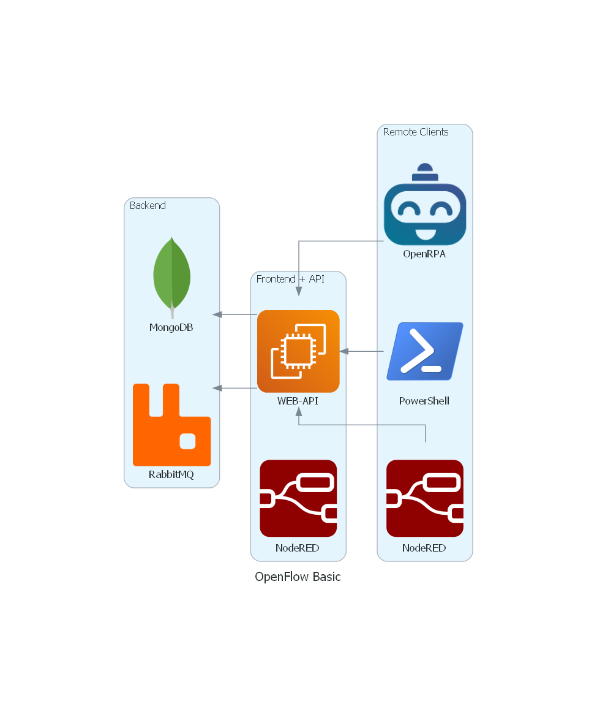
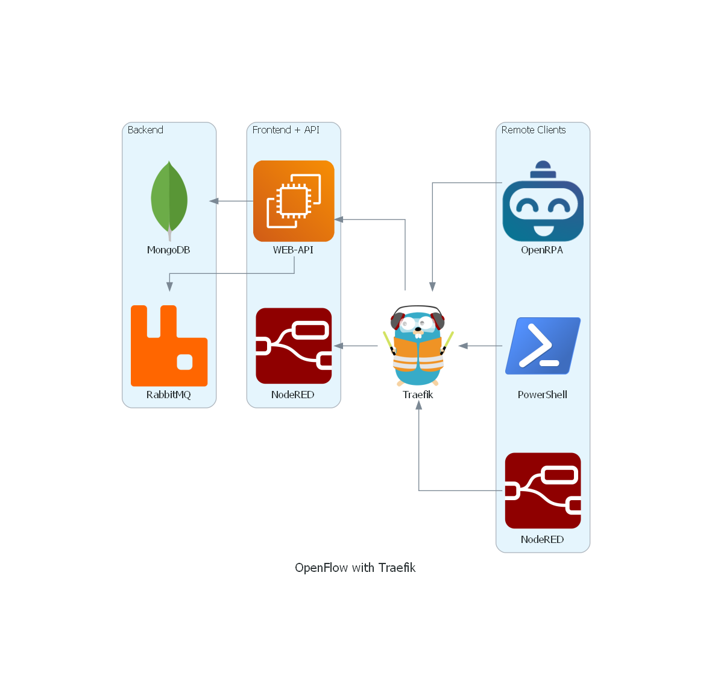
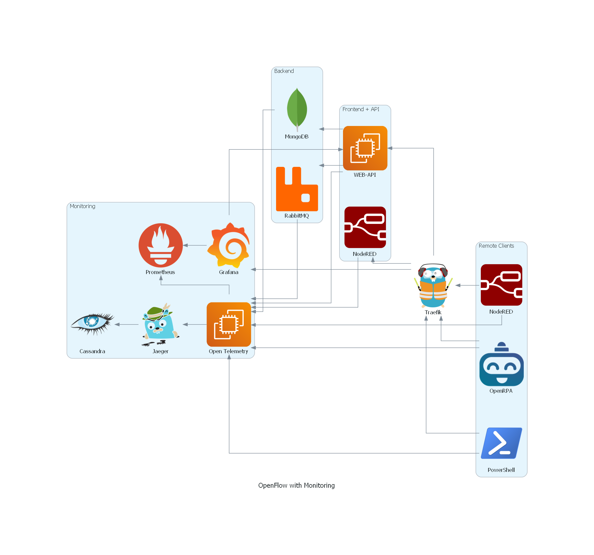

## Architecture

OpenFlow is an extendible stack, it's core components consist of a [MongoDB](https://www.mongodb.com/) database (preferably a replica set to allow support for change streams).
A stateless [RabbitMQ](https://www.rabbitmq.com/) (Can be run with durable queues and persistent storage.) OpenFlow API and web interface.
If deployed in docker, you can spin up multiple NodeRED instances using the API or the web interface.
Different types of clients, [custom web](https://github.com/open-rpa/openflow-web-angular11-template) interfaces, [OpenRPA](https://github.com/open-rpa/openrpa) robots, PowerShell modules and remotely installed NodeRED's can then connect to the OpenFlow API using web sockets and receive events and data. Clients will use the API to register/publish queues and exchanges in order to add an extra layer of authentication and to simply for network requirements. All database access is exposed as natively close to the MongoDB driver, but with an added layer of security though the API.

If installed [using NPM](https://openflow.openiap.io/npmopenflow) or the basic [docker-compose](https://github.com/open-rpa/openflow/blob/master/docker-compose.yml) file that would like something like this.

But for most people you should go for the docker install using [traefik](https://traefik.io/) as an ingress controller/reverse proxy. This way we can segregate internal traffic that only OpenFlow should know about from traffic going in and out to the rest of the network/world. That will look something like below.

For bigger installations we recommend using kubernetes, we supply an easy to get started with [helm chart](https://github.com/open-rpa/helm-charts/), that also supports very complex demands. Besides adding easy access for running geo distributed installation ( multiple data centers ) of a single OpenFlow install, it also adds more layers of security and much needed fault tolerance and scalability. This is usually also when we want to add better monitoring of the core components and support for designing graphs and dashboard based on data in OpenFlow.

When running in high secured network, where you need to control the direction and priority the flow of data and events, OpenFlow can be deployed in mesh topologies. 
This can also be useful if working in distributed networks where network outage can last for very long periods of time, and the local storage of a remote NodeRED is not enough, or you need access to the web interface and reports even when the network is down.
