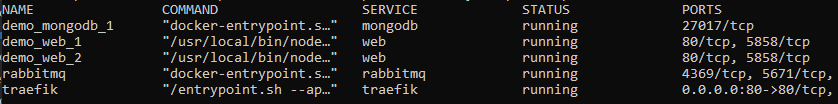
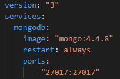

# Docker Compose

To quickly get started with your own installation you can use one of these docker-compose files.
download the file you want ( you can rename the file to docker-compose.yaml or use -f to specify the file )

[docker-compose-traefik.yml](https://github.com/open-rpa/openflow/blob/master/docker-compose-traefik.yml) is for people running docker ce/docker desktop

open a shell and cd to that folder you downloaded the file to, and type
( you need to rename the downloaded file to docker-compose.yml, or use the next command instead )

```bash
docker-compose up
```

Say you downloaded docker-compose-traefik.yml and you want to set your own project name. 

```bash
docker-compose -f docker-compose-traefik.yml -p demo up
```

This will be the basis for everything else you do, for instance, if you need to update the images to the latest version, you would then use 

```bash
docker-compose -f docker-compose-traefik.yml -p demo pull
```

Then you can access the API/web on [http://localhost.openiap.io](http://localhost.openiap.io) 
and RabbitMQ on  [http://mq.localhost.openiap.io](http://mq.localhost.openiap.io) 

The first username and password you try to login as, will be created and made admin. This **cannot** be admin, root or other common administrate account names.

For almost everyone, you will want to start with docker-compose-traefik.yml
This gives you a good starting point for testing it on your local machine, and play around with the settings. Once you understand how it works, and you know how to change the domain names it responds too, then you can push this to a server locally or to some cloud provider. If you have a public IP for the solution you can also have a look at [docker-compose-traefik-letsencrypt.yml](https://github.com/open-rpa/openflow/blob/master/docker-compose-traefik-letsencrypt.yml) for a guide on how to use Lets Encrypt for certificates.
For more complex setups where you don't have public IP or just need access to wildcard certificates there is also an example on how to request Lets Encrypt certificates using DNS01 in the [docker-compose-traefik-letsencrypt-dns01.yml](https://github.com/open-rpa/openflow/blob/master/docker-compose-traefik-letsencrypt-dns01.yml) file.

In this video the whole process is showed on ubuntu 18 
[](https://youtu.be/YdH3h3iAu-Y)


Troubleshooting tip.

If something is not working, make sure all instances are running, if on windows client simply open the docker UI and expand the project. for everyone else you can use 

```bash
docker-compose -f docker-compose-traefik.yml -p demo ps
```

and make sure all is running



If one is not running, check the logs by specifying the service name ( SERVICE table ) for instance to watch web logs

```bash
docker-compose -f docker-compose-traefik.yml -p demo logs web
```

If you want to watch the logs lice you can add the follow flag

```bash
docker-compose -f docker-compose-traefik.yml -p demo logs web -f
```

1) Its a know issue rabbitmq can take a bit long to startup on docker desktop that will make the web instances restart a few times until rabbitmq is responding. 
2) It's a know issue that with mongodb 5 you need to be running on a processor that supports AVX and have an updated docker installation. A work around can be to specify you want to use mongodb 4 instead 



For questions or help, feel free to join the community on the [forum](https://bb.openiap.io) or [rocket chat](https://rocket.openiap.io).

For help with running on [kubernetes](kubernetes) or self hosting, feel free to contact [OpenIAP](https://openiap.io/) for a commercial support options.

