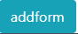
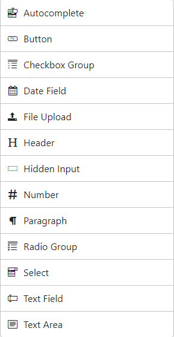
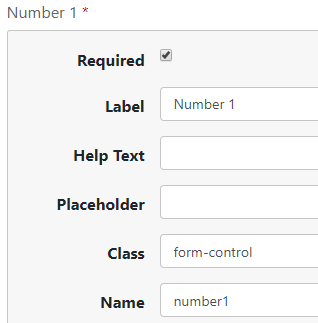
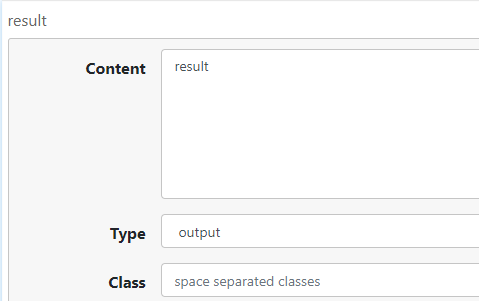
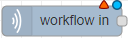
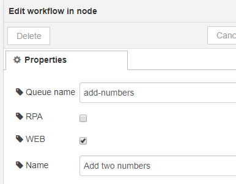
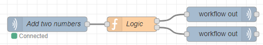
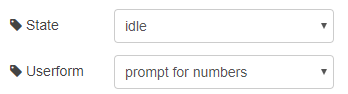
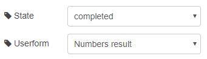
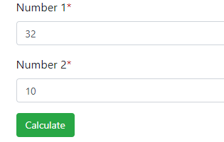

# Workflow with form

Login to OpenFlow and click Forms, then click add form



At the top you can name your form and also select what Identity Providers you would like to support for this form. You also have the option to allow anonymous access (please be aware of the implications of using anonymous access ) lets call this form "prompt for numbers"

On the right side, you have a palette of different HTML controls you can drag and drop on to your "canvas", each control have different properties, but for now, just know that Name is what identifies this control in the workflow we will be creating shortly



Lets drag in a 2 number fields, and name them number1 and number2 



Lastly, we need to add a submit button, so the user can send the input back back . So drag in a button and change the type to submit


Add another form and name it "Numbers result". 

Drag in a Paragraph, and in Content give it the name result



Now sign in to one of your NodeRED instances an drag in a "workflow in" 



Double click the node and assign a unique name without any special characters in Queue name and give it a descriptive text in Name, make sure you check WEB, so the workflow becomes visible on the webpage.



Now add a function node and increment Outputs to 2, and past in the following JavaScript

```javascript
var number1 = parseInt(msg.payload.number1);
var number2 = parseInt(msg.payload.number2);
msg.payload.result = "";
if(msg.payload.number1 === undefined || 
    msg.payload.number2 === undefined) {
    return msg;
} else {
    msg.payload.result = number1 + number2;
	return [null, msg];
} 

```
We want to control what happens based on the input we get. First time we get called we don't have any data, so we return the form with status idle. Once we have an two numbers can add them and return the result. We control the output node by returning an array, and each element in the array represents an output.

Finally drag in 2 "workflow out" nodes and connect each of them to one of the output nodes of the function, then connect the function node with the "workflow in" node



Now configure the top "workflow out" node to return the "prompt for numbers" form and set the workflow status to idle ( waiting for user input)



and set the last "workflow out" node to return the "Numbers result" form, with status complete



Now login to OpenFlow, click workflows and you will see your "Add two numbers" workflow listed. Click the invoke button/link and type in two numbers in the form



and once you click Calculate you should see the result


Try to add an Radio group and give the user the option to select an action, and then update the function in NodeRed as needed.


