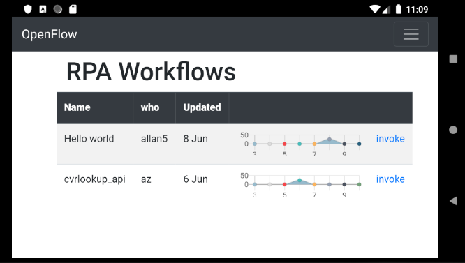
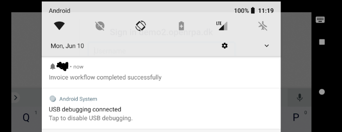
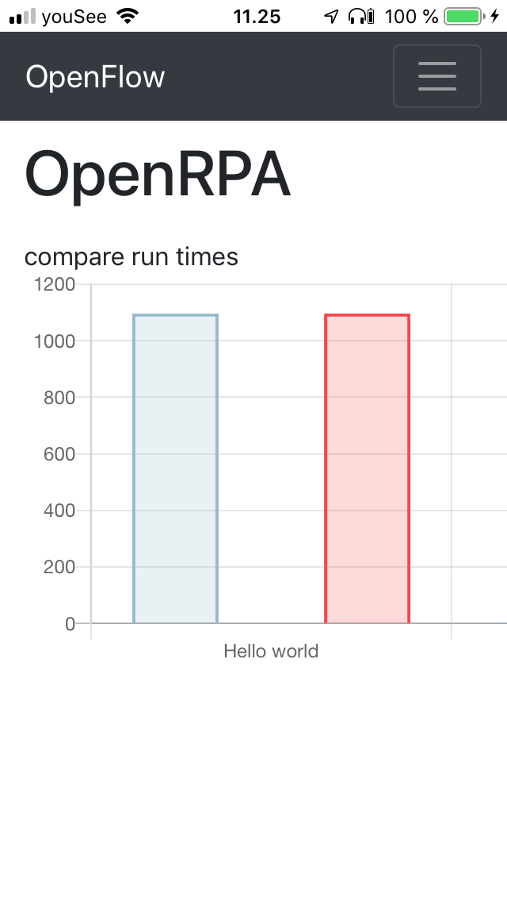

# Mobile app

OpenFlow also have a mobile app version, based on the [cordova](https://cordova.apache.org/) framework ( still considering a move toward [flutter](https://flutter.dev/) at some point ). Using the app gives you the option to notify users or your self of important events using push notifications ( monitoring, notify of new forms that needs to be completed, robots that fails or go stall etc )

That way you always have your platform easily accessible in your pocket. 

