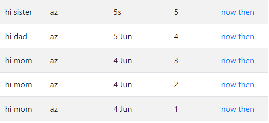
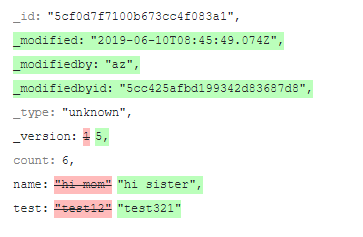
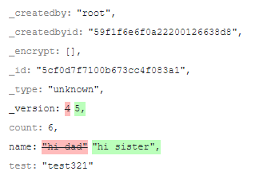

## Versioning

OpenFlow has a simple versioning system built in. Using [jsondiff](https://github.com/benjamine/jsondiffpatch) and/or full copy of object you can always go back in time and see who changed what, and when and easily revert back and forth to different versions.

Go to the object page, select the collection you are interested in and click the history icon, you will then be presented for a list of changes to that object.

Press now to see the difference between what the object is now and at that point in town.

Press then, to see what updates was made to the object at that point in time

